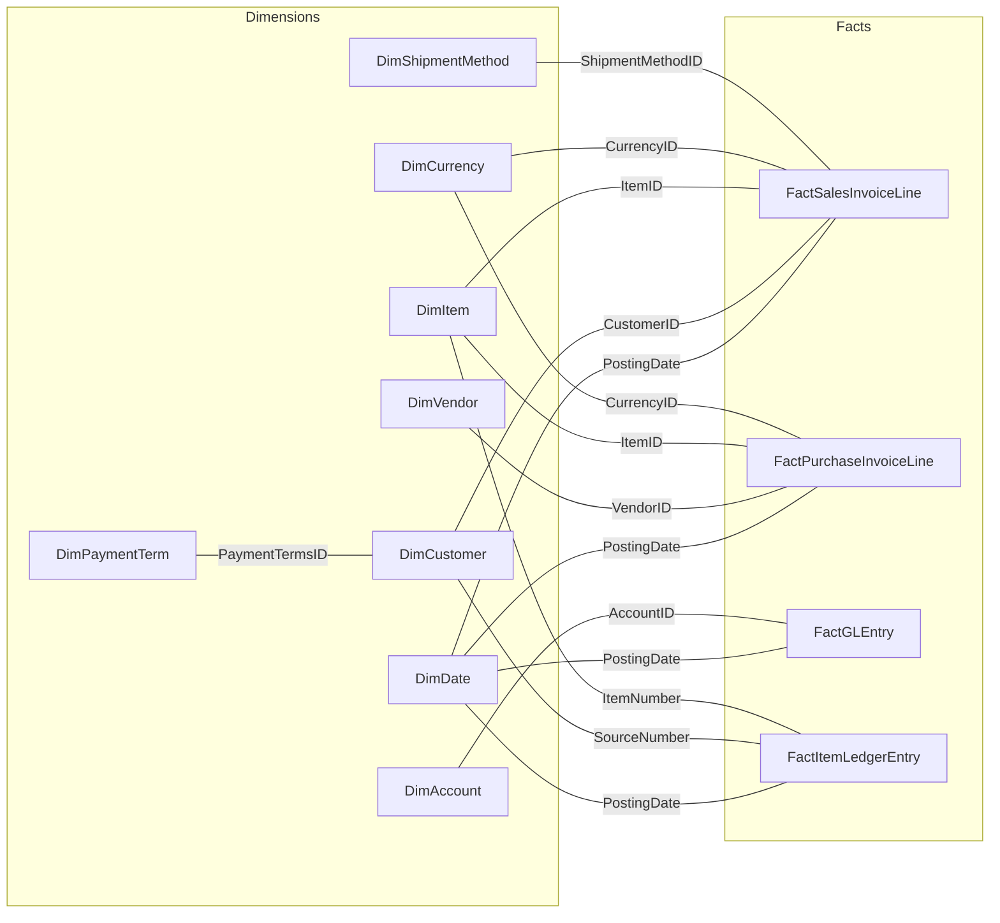
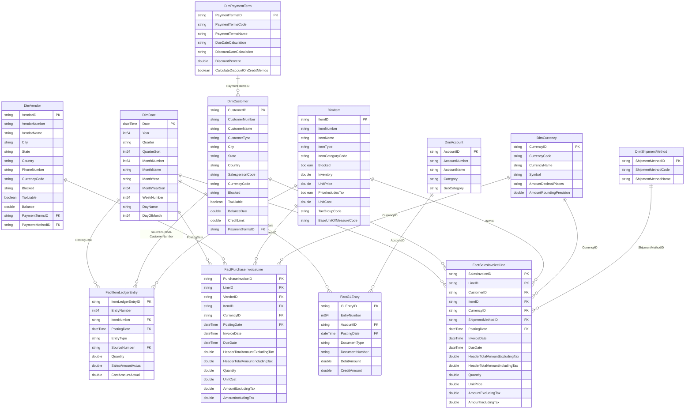

# CRONUS Data Modeling & Visualization

A Power BI Desktop Project (PBIP) that models and visualizes financial and operational data from **Microsoft Dynamics 365 Business Central** — specifically the CRONUS UK Ltd. demo company. The semantic model follows a **star schema** design with dedicated dimension tables, fact tables at invoice-line and entry-level grain, calculated measure groups organized by business domain, and a custom M-generated date dimension.

This project enables **executive-level financial reporting**, **sales & purchase performance analysis**, **general ledger tracking**, and **inventory margin analysis** — all sourced live from Business Central's API.

> **Note:** Power BI Desktop projects (PBIP) is a **preview** feature. You must enable it before opening or saving this project: *File → Options and settings → Options → Preview features → Power BI Project (.pbip) save option*.

---

## Project Structure

```
CRONUS_DATA_MODELING_VISUALIZATION/
├── CRONUS_DATA_MODELING_VISUALIZATION.pbip          # Project entry point
├── CRONUS_DATA_MODELING_VISUALIZATION.Report/       # Report definition
│   ├── .pbi/
│   │   └── localSettings.json                       # (gitignored) Local editor state
│   ├── .platform                                    # Fabric platform metadata
│   ├── StaticResources/SharedResources/             # Theme assets (CY26SU04 + NewExecutive)
│   ├── definition.pbir                              # Report properties & dataset reference
│   ├── definition/
│   │   ├── version.json                             # Report definition version (2.0.0)
│   │   ├── report.json                              # Report layout, themes & settings
│   │   └── pages/                                   # 5 report pages with visuals
├── CRONUS_DATA_MODELING_VISUALIZATION.SemanticModel/ # Semantic model definition
│   ├── .pbi/
│   │   ├── cache.abf                                # (gitignored) Local data cache
│   │   ├── editorSettings.json                      # (gitignored) Editor preferences
│   │   └── localSettings.json                       # (gitignored) Local model state
│   ├── .platform                                    # Fabric platform metadata
│   ├── definition/
│   │   ├── cultures/en-US.tmdl                      # Culture metadata
│   │   ├── database.tmdl                            # Database level (compat 1601)
│   │   ├── model.tmdl                               # Model metadata & table refs
│   │   ├── relationships.tmdl                       # All relationships (business + auto-date)
│   │   └── tables/                                  # One .tmdl per table (31 files)
│   ├── definition.pbism                             # Semantic model properties (v4.2)
│   └── diagramLayout.json                           # Model diagram layout
└── .gitignore                                       # Excludes .pbi/ local files & .DS_Store
```

---

## Data Source

| Property | Value |
|---|---|
| **Source System** | Dynamics 365 Business Central API v2.0 |
| **Environment** | PRODUCTION |
| **Company** | CRONUS UK Ltd. |
| **Connector** | `Dynamics365BusinessCentral.ApiContentsWithOptions` |
| **Storage Mode** | Import |
| **Culture** | en-US |
| **Compatibility Level** | 1601 |

All tables connect to the same Business Central instance. Dimension tables follow a consistent M pattern: `Source → SelectColumns → RenameColumns`. Fact invoice tables use an expanded pattern: `Source → ExpandTableColumn → SelectColumns → RenameColumns`. The `DimItem` table applies additional transformations: removing `ItemName2` and replacing null/blank `ItemCategoryCode` values with `"Uncategorized"`.

---

## Semantic Model

### Star Schema Overview



### Dimension Tables

| Table | Key Column | Source API Endpoint | Description |
|---|---|---|---|
| `DimCustomer` | `CustomerID` (hidden) | `customers` | Customer master with address, contact, tax, credit, and salesperson info |
| `DimVendor` | `VendorID` (hidden) | `vendors` | Vendor master with address, contact, tax, and balance info |
| `DimItem` | `ItemID` (hidden) / `ItemNumber` | `items` | Item master with pricing, costing, category, and posting groups |
| `DimAccount` | `AccountID` (hidden) | `accounts` | G/L account master with category & subcategory |
| `DimCurrency` | `CurrencyID` | `currencies` | Currency definitions with symbol, decimal places & rounding precision |
| `DimPaymentTerm` | `PaymentTermsID` | `paymentTerms` | Payment terms with due/discount date calculations |
| `DimShipmentMethod` | `ShipmentMethodID` | `shipmentMethods` | Shipment method codes and names |
| `DimDate` | `Date` (key) | *Calculated (M)* | Custom date dimension: 2020-01-01 → 2030-12-31 |

### Fact Tables

| Table | Key Column(s) | Source API Endpoint | Grain |
|---|---|---|---|
| `FactSalesInvoiceLine` | `SalesInvoiceID` + `LineID` | `salesInvoices` → expand `salesInvoiceLines` | One row per sales invoice line (includes header-level denormalized fields) |
| `FactPurchaseInvoiceLine` | `PurchaseInvoiceID` + `LineID` | `purchaseInvoices` → expand `purchaseInvoiceLines` | One row per purchase invoice line (includes header-level denormalized fields) |
| `FactGLEntry` | `GLEntryID` | `generalLedgerEntries` | One row per G/L entry |
| `FactItemLedgerEntry` | `ItemLedgerEntryID` | `itemLedgerEntries` | One row per item ledger entry |

### Measure Tables

Calculated tables (using `ROW("Dummy", 1)` or `Row("Column", BLANK())` as a placeholder partition) that serve as organizational containers for DAX measures. All monetary measures use **€ (Euro)** format strings.

**MeasureSales** — 11 measures

| Measure | DAX | Explanation | Example |
|---|---|---|---|
| Total Sales Excl Tax | `SUMX(VALUES(FactSalesInvoiceLine[SalesInvoiceID]), CALCULATE(MIN(…HeaderTotalAmountExcludingTax)))` | Total revenue from all sales invoices, excluding tax. Uses SUMX+MIN to avoid double-counting header amounts across line items. | 3 invoices for €1,000 each → **€3,000** |
| Total Sales Incl Tax | `SUMX(VALUES(…SalesInvoiceID]), CALCULATE(MIN(…HeaderTotalAmountIncludingTax)))` | Same as above but includes tax amounts. | €3,000 sales + €600 tax → **€3,600** |
| Sales Invoice Count | `DISTINCTCOUNT(FactSalesInvoiceLine[SalesInvoiceID])` | Number of unique sales invoices issued. | 3 invoices → **3** |
| Average Sales per Invoice | `DIVIDE([Total Sales Excl Tax], [Sales Invoice Count])` | Average revenue per invoice. | €3,000 ÷ 3 invoices → **€1,000** |
| Sales YTD | `TOTALYTD([Total Sales Excl Tax], DimDate[Date])` | Cumulative sales from Jan 1 of the current year up to the selected date. Resets every January. | Jan €40K + Feb €35K + Mar €20K (to date) → **€95,000** |
| Sales MTD | `TOTALMTD([Total Sales Excl Tax], DimDate[Date])` | Cumulative sales from the 1st of the current month up to the selected date. Resets every month. | Mar 1–15 daily sales total → **€20,000** |
| Sales PY | `CALCULATE([Total Sales Excl Tax], SAMEPERIODLASTYEAR(DimDate[Date]))` | Sales for the same period in the prior year. Used as the baseline for YoY comparison. | If viewing Jan–Mar 2025, shows Jan–Mar **2024** sales → **€80,000** |
| Sales YoY % | `DIVIDE([Total Sales Excl Tax] - [Sales PY], [Sales PY])` | Percentage growth (or decline) compared to the same period last year. Positive = growth, negative = decline. | 2025 sales €120K, 2024 sales €100K → (20K ÷ 100K) = **+20%** |
| Sales Tax Amount | `[Total Sales Incl Tax] - [Total Sales Excl Tax]` | Total VAT/tax collected on sales. | €3,600 incl − €3,000 excl → **€600** |
| Gross Profit | `[Total Sales Excl Tax] - [Total Purchase Excl Tax]` | Revenue minus cost of goods purchased. Answers: did we sell for more than we bought? | Sales €100K − Purchases €65K → **€35,000** |
| Gross Margin % | `IF([Total Sales Excl Tax] = 0, BLANK(), [Gross Profit] / [Total Sales Excl Tax])` | Out of every €1 of sales, how much is kept after paying for goods. Higher = more profitable. | €35K profit ÷ €100K sales → **35%** (keep €0.35 per €1) |

> **Design Note:** `Total Sales Excl Tax` and `Total Sales Incl Tax` use `SUMX` over `SalesInvoiceID` with `MIN` of header-level amounts. This avoids double-counting when multiple line items share the same invoice header totals.

**MeasurePurchases** — 9 measures

| Measure | DAX | Explanation | Example |
|---|---|---|---|
| Total Purchase Excl Tax | `SUMX(VALUES(…PurchaseInvoiceID]), CALCULATE(MIN(…HeaderTotalAmountExcludingTax)))` | Total spending on purchase invoices, excluding tax. Same SUMX+MIN pattern as sales to avoid double-counting. | 5 purchase invoices averaging €2K each → **€10,000** |
| Total Purchase Incl Tax | `SUMX(VALUES(…PurchaseInvoiceID]), CALCULATE(MIN(…HeaderTotalAmountIncludingTax)))` | Same as above but includes tax. | €10,000 purchases + €2,000 tax → **€12,000** |
| Purchase Invoice Count | `DISTINCTCOUNT(FactPurchaseInvoiceLine[PurchaseInvoiceID])` | Number of unique purchase invoices received. | 5 invoices → **5** |
| Average Purchase per Invoice | `DIVIDE([Total Purchase Excl Tax], [Purchase Invoice Count])` | Average cost per purchase invoice. | €10,000 ÷ 5 invoices → **€2,000** |
| Purchase YTD | `TOTALYTD([Total Purchase Excl Tax], DimDate[Date])` | Cumulative purchases from Jan 1 up to the selected date. Resets every January. | Jan €25K + Feb €22K + Mar €13K → **€60,000** |
| Purchase MTD | `TOTALMTD([Total Purchase Excl Tax], DimDate[Date])` | Cumulative purchases from the 1st of the current month up to the selected date. Resets every month. | Mar 1–15 purchases → **€13,000** |
| Purchase PY | `CALCULATE([Total Purchase Excl Tax], SAMEPERIODLASTYEAR(DimDate[Date]))` | Purchases for the same period in the prior year. Baseline for YoY comparison. | If viewing Jan–Mar 2025, shows Jan–Mar **2024** purchases → **€50,000** |
| Purchase YoY % | `DIVIDE([Total Purchase Excl Tax] - [Purchase PY], [Purchase PY])` | Percentage change in purchase spending vs. same period last year. Read alongside Sales YoY %: spending more because sales grew (good) vs. costs rising (bad). | 2025 purchases €78K, 2024 purchases €65K → (13K ÷ 65K) = **+20%** |
| Purchase Tax Amount | `[Total Purchase Incl Tax] - [Total Purchase Excl Tax]` | Total VAT/tax paid on purchases. | €12,000 incl − €10,000 excl → **€2,000** |

> **Design Note:** Same `SUMX` + `MIN` pattern as sales measures to correctly handle header-level amounts at line-level grain.

**MeasureGL** — 4 measures

| Measure | DAX | Explanation | Example |
|---|---|---|---|
| GL Debit | `SUM(FactGLEntry[DebitAmount])` | Total of all debit entries in the general ledger (money received or assets increased). | All debit postings across every GL account → **€500,000** |
| GL Credit | `SUM(FactGLEntry[CreditAmount])` | Total of all credit entries in the general ledger (money paid out or liabilities increased). | All credit postings across every GL account → **€490,000** |
| GL Net | `ROUND([GL Debit] - [GL Credit], 2)` | Net financial result after ALL expenses (purchases, salaries, rent, utilities, depreciation, taxes). This is the true bottom line. | €500K debits − €490K credits → **€10,000** net profit |
| Net Profit % | `IF([Total Sales Excl Tax] = 0, BLANK(), [GL Net] / [Total Sales Excl Tax])` | Out of every €1 of sales, how much remains after every single expense. Always lower than Gross Margin % (which only deducts purchases). | €10K net profit ÷ €100K sales → **10%** (keep €0.10 per €1 after all costs) |

**MeasureInventory** — 4 measures

| Measure | DAX | Explanation | Example |
|---|---|---|---|
| Inventory Cost Amount | `CALCULATE(SUM(FactItemLedgerEntry[CostAmountActual]), EntryType="Sale")` | Total cost of goods sold (COGS) for Sale entries. In BC, this is stored as a **negative** value for sales and **positive** for returns. | Sale: CostAmount = −€6,000; Return: CostAmount = +€1,000; Total → **−€5,000** |
| Inventory Sales Amount | `CALCULATE(SUM(FactItemLedgerEntry[SalesAmountActual]), EntryType="Sale")` | Total revenue from item ledger Sale entries. Positive for sales, negative for returns. | Sale: SalesAmount = +€10,000; Return: SalesAmount = −€2,000; Total → **€8,000** |
| Inventory Margin | `[Inventory Sales Amount] + [Inventory Cost Amount]` | Profit on inventory items. Uses **addition** because CostAmountActual is negative for sales, so adding it to sales yields the margin. | €8,000 sales + (−€5,000 cost) → **€3,000** margin |
| Inventory Margin % | `DIVIDE([Inventory Margin], [Inventory Sales Amount])` | Percentage of inventory revenue that is profit. Same concept as Gross Margin % but calculated from item-level ledger data. | €3,000 margin ÷ €8,000 sales → **37.5%** |

> **Design Note:** Inventory measures filter to `EntryType = "Sale"` only. `Inventory Margin` uses **addition** (`+`) rather than subtraction because `CostAmountActual` for Sale entries is stored as a **negative value** in Business Central, so adding the negative cost to the positive sales amount yields the margin.

### Auto-Generated Tables

Power BI's **Auto date/time** feature generates 14 `LocalDateTable_<guid>` tables and 1 `DateTableTemplate_<guid>` table. These provide automatic date hierarchies for every datetime column across fact and dimension tables. They are managed entirely by Power BI Desktop and **must not be edited externally**.

---

## Relationships

### Business Relationships (15 total)

These are the active relationships that define the star schema:



### Relationship Detail Reference

| # | From Column (Many side) | To Column (One side) | Cardinality |
|---|---|---|---|
| 1 | `FactSalesInvoiceLine.CustomerID` | `DimCustomer.CustomerID` | Many-to-One |
| 2 | `DimCustomer.PaymentTermsID` | `DimPaymentTerm.PaymentTermsID` | Many-to-One |
| 3 | `FactPurchaseInvoiceLine.VendorID` | `DimVendor.VendorID` | Many-to-One |
| 4 | `FactItemLedgerEntry.ItemNumber` | `DimItem.ItemNumber` | Many-to-One |
| 5 | `FactGLEntry.AccountID` | `DimAccount.AccountID` | Many-to-One |
| 6 | `FactSalesInvoiceLine.ItemID` | `DimItem.ItemID` | Many-to-One |
| 7 | `FactPurchaseInvoiceLine.ItemID` | `DimItem.ItemID` | Many-to-One |
| 8 | `FactSalesInvoiceLine.CurrencyID` | `DimCurrency.CurrencyID` | Many-to-One |
| 9 | `FactPurchaseInvoiceLine.CurrencyID` | `DimCurrency.CurrencyID` | Many-to-One |
| 10 | `FactSalesInvoiceLine.ShipmentMethodID` | `DimShipmentMethod.ShipmentMethodID` | Many-to-One |
| 11 | `FactGLEntry.PostingDate` | `DimDate.Date` | Many-to-One |
| 12 | `FactSalesInvoiceLine.PostingDate` | `DimDate.Date` | Many-to-One |
| 13 | `FactPurchaseInvoiceLine.PostingDate` | `DimDate.Date` | Many-to-One |
| 14 | `FactItemLedgerEntry.PostingDate` | `DimDate.Date` | Many-to-One |
| 15 | `FactItemLedgerEntry.SourceNumber` | `DimCustomer.CustomerNumber` | Many-to-One |

> All 15 business relationships follow the star schema pattern: fact/dimension tables on the **Many** side connect to dimension tables on the **One** side. Cross-filter direction is **Single** (from Many to One) unless otherwise noted, meaning filters flow from dimensions into facts — the standard pattern for analytical queries.

### Auto-Date Relationships

Power BI's Auto date/time feature generates 14 additional relationships, each connecting a datetime column (e.g., `InvoiceDate`, `DueDate`, `LastModifiedDateTime`) from fact and dimension tables to its own auto-created `LocalDateTable_<guid>` table. These provide built-in date hierarchies (Year → Quarter → Month → Day) for every datetime field. They are managed entirely by Power BI Desktop, **must not be edited externally**, and are excluded from the relationship diagram above for clarity.

---

## Report

The report contains **5 pages** with interactive visuals, using the **NewExecutive** custom theme layered on the **CY26SU04** base theme. All pages use **FitToPage** display at 1280 × 720.

| Page | Visuals | Visual Types |
|---|---|---|
| **Executive Overview** | 11 | Combo chart (line + stacked column), KPI cards (×6), clustered bar charts (×2), slicers (×2) |
| **Sales Performance** | 7 | Line chart, donut chart, KPI cards (×2), clustered bar chart, column chart, slicer |
| **Purchase Analysis** | 7 | Line chart, donut chart, KPI cards (×2), clustered bar chart, column chart, slicer |
| **Financial Overview** | 8 | Pivot table, column chart, KPI cards (×2), clustered bar charts (×2), slicers (×2) |
| **Inventory & Margin** | 10 | Area chart, scatter chart, KPI cards (×4), clustered bar charts (×2), slicers (×2) |

| Property | Value |
|---|---|
| **Base Theme** | CY26SU04 |
| **Custom Theme** | NewExecutive |
| **Report Definition Version** | 2.0.0 |
| **Semantic Model Binding** | Relative path: `../CRONUS_DATA_MODELING_VISUALIZATION.SemanticModel` |
| **Active Page** | Inventory & Margin |

---

## Getting Started

### Prerequisites

- **Power BI Desktop** (latest monthly release)
- **Dynamics 365 Business Central** access (PRODUCTION environment, CRONUS UK Ltd. company)
- **Git** (recommended for version control)

### Enable PBIP Preview

1. Open Power BI Desktop
2. Go to *File → Options and settings → Options → Preview features*
3. Check **Power BI Project (.pbip) save option**
4. Restart Power BI Desktop

### Open the Project

Double-click `CRONUS_DATA_MODELING_VISUALIZATION.pbip` or open `CRONUS_DATA_MODELING_VISUALIZATION.Report/definition.pbir` in Power BI Desktop. Both open the report for editing with the connected semantic model.

### Refresh Data

On first open, Power BI Desktop will prompt for credentials to connect to the Business Central API. After authentication, use **Refresh** to load data into the import-mode model.

---

## Version Control & Git

This project uses the PBIP format specifically for Git-friendly source control. Key points:

### .gitignore

The following entries are configured (Power BI Desktop creates some automatically on first PBIP save):

```gitignore
**/.pbi/localSettings.json
**/.pbi/cache.abf
**/.pbi/editorSettings.json
.DS_Store
```

- `localSettings.json` — machine-specific editor settings (not shareable)
- `cache.abf` — local data cache binary (can be large; never commit)
- `editorSettings.json` — personal editor preferences (not shareable)
- `.DS_Store` — macOS folder metadata

### Git Configuration

```bash
# Power BI Desktop uses CRLF line endings; configure Git to handle this
git config --global core.autocrlf true   # Windows
git config --global core.autocrlf input  # macOS/Linux
```

### File Editing Outside Power BI Desktop

| Files | Safe to edit externally? | Notes |
|---|---|---|
| `definition/tables/*.tmdl` | ✅ Yes | TMDL metadata; use VS Code with intellisense |
| `definition/model.tmdl` | ✅ Yes | Model-level metadata |
| `definition/relationships.tmdl` | ✅ Yes | Relationship definitions |
| `definition/cultures/*.tmdl` | ✅ Yes | Culture/translation metadata |
| `definition/database.tmdl` | ✅ Yes | Compatibility level |
| `report.json` | ❌ No | Not documented; external edits unsupported |
| `diagramLayout.json` | ❌ No | Not documented; external edits unsupported |
| `LocalDateTable_*.tmdl` | ❌ No | Auto-generated; do not modify |
| `DateTableTemplate_*.tmdl` | ❌ No | Auto-generated; do not modify |

**Critical:** After any external file edit, you **must restart Power BI Desktop** for changes to be reflected. PBI Desktop does not detect external file changes while running.

### Encoding

All PBIP files must be saved as **UTF-8 without BOM** when editing outside Power BI Desktop.

### Path Length

Windows has a 260-character max path limit by default. Because PBIP uses nested folders, keep the root path short to avoid save errors.

---

## Deployment

This project can be deployed to a Fabric workspace using:

| Method | Deploys | Steps |
|---|---|---|
| **Power BI Desktop Publish** | Metadata + local data cache | Open `.pbip` in PBI Desktop → click **Publish** → select workspace |
| **Fabric Git Integration** | Metadata only | Connect workspace to Git repo; syncs on commit |
| **Fabric REST API** | Metadata only | Programmatic deployment via `POST /items` |

### Publish from Power BI Desktop

1. Open `CRONUS_DATA_MODELING_VISUALIZATION.pbip` in Power BI Desktop
2. Refresh data if needed
3. Click **Publish** on the Home ribbon
4. Select the target Fabric workspace
5. The semantic model and report are deployed together

### Deploy via Fabric Git Integration

1. Push this repo to a Git provider (Azure DevOps, GitHub, etc.)
2. In a Fabric workspace, connect to the Git branch
3. Commit and push changes — Fabric syncs automatically

---

## Considerations & Limitations

- PBIP is a **preview** feature — breaking changes are possible
- **Sensitivity labels** are not supported with PBIP
- **Report Linguistic Schema** (page synonyms) is not supported
- **OneDrive/SharePoint** direct save is unsupported; use a locally synced folder with caution
- **RLS role members** cannot be get/set via Fabric REST API
- **Incremental refresh partitions** are not exported via Fabric REST API (exports the query from the refresh policy instead)
- PBIP is **not supported** in Power BI Desktop for Power BI Report Server
- Diagram view is ignored when editing models in the Service

---

## JSON Schema References

PBIP files use publicly documented JSON schemas for validation and intellisense:

| File | Schema |
|---|---|
| `.pbip` | `https://developer.microsoft.com/json-schemas/fabric/pbip/pbipProperties/1.0.0/schema.json` |
| `definition.pbir` | `https://developer.microsoft.com/json-schemas/fabric/item/report/definitionProperties/2.0.0/schema.json` |
| `definition.pbism` | `https://developer.microsoft.com/json-schemas/fabric/item/semanticModel/definitionProperties/1.0.0/schema.json` |
| `.platform` | `https://developer.microsoft.com/json-schemas/fabric/gitIntegration/platformProperties/2.0.0/schema.json` |

Full schema catalog: [github.com/microsoft/json-schemas/tree/main/fabric](https://github.com/microsoft/json-schemas/tree/main/fabric)

---

## References

- [Power BI Desktop projects overview](https://learn.microsoft.com/en-us/power-bi/developer/projects/projects-overview)
- [Project semantic model folder](https://learn.microsoft.com/en-us/power-bi/developer/projects/projects-dataset)
- [Project report folder](https://learn.microsoft.com/en-us/power-bi/developer/projects/projects-report)
- [PBIP Git integration](https://learn.microsoft.com/en-us/power-bi/developer/projects/projects-git)
- [Fabric CI/CD workflows](https://learn.microsoft.com/en-us/fabric/cicd/manage-deployment)
- [Tabular Object Model (TOM)](https://learn.microsoft.com/en-us/analysis-services/tom/introduction-to-the-tabular-object-model-tom-in-analysis-services-amo)
- [Power BI implementation planning](https://learn.microsoft.com/en-us/power-bi/guidance/powerbi-implementation-planning-content-lifecycle-management-overview)
