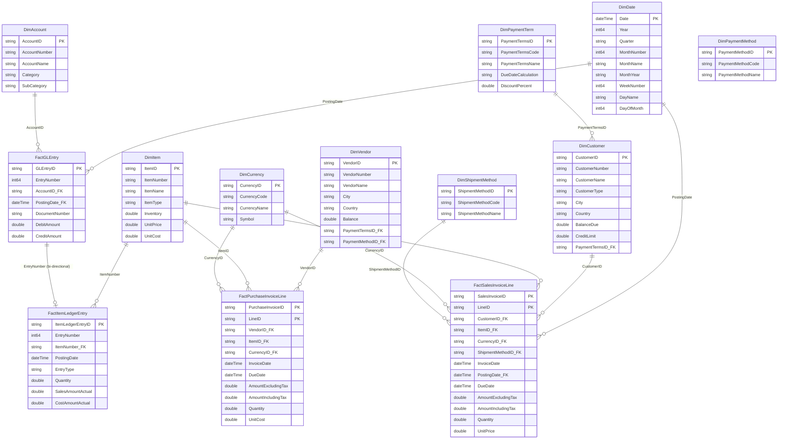

# CRONUS Data Modeling & Visualization

A Power BI Desktop Project (PBIP) that models and visualizes financial data from **Dynamics 365 Business Central** — specifically the CRONUS UK Ltd. demo company. The semantic model follows a star schema with dedicated dimension and fact tables, calculated measure groups, and a custom date dimension.

> **Note:** Power BI Desktop projects (PBIP) is a **preview** feature. You must enable it before opening or saving this project: *File → Options and settings → Options → Preview features → Power BI Project (.pbip) save option*.

---

## Project Structure

```
CRONUS_DATA_MODELING_VISUALIZATION/
├── CRONUS_DATA_MODELING_VISUALIZATION.pbip          # Project entry point
├── CRONUS_DATA_MODELING_VISUALIZATION.Report/       # Report definition
│   ├── .pbi/
│   │   └── localSettings.json                       # (gitignored) Local editor state
│   ├── .platform                                    # Fabric platform metadata
│   ├── StaticResources/SharedResources/BaseThemes/  # Theme assets (CY26SU04)
│   ├── definition.pbir                              # Report properties & dataset reference
│   └── report.json                                  # Report layout & visual definitions
├── CRONUS_DATA_MODELING_VISUALIZATION.SemanticModel/ # Semantic model definition
│   ├── .pbi/
│   │   ├── cache.abf                                # (gitignored) Local data cache
│   │   ├── editorSettings.json                      # (gitignored) Editor preferences
│   │   └── localSettings.json                       # (gitignored) Local model state
│   ├── .platform                                    # Fabric platform metadata
│   ├── definition/
│   │   ├── cultures/en-US.tmdl                      # Culture metadata
│   │   ├── database.tmdl                            # Database level (compat 1600)
│   │   ├── model.tmdl                               # Model metadata & table refs
│   │   ├── relationships.tmdl                       # All relationships
│   │   └── tables/                                  # One .tmdl per table
│   ├── definition.pbism                             # Semantic model properties
│   └── diagramLayout.json                           # Model diagram layout
└── .gitignore                                       # Excludes .pbi/localSettings.json & cache.abf
```

---

## Data Source

| Property | Value |
|---|---|
| **Source System** | Dynamics 365 Business Central API v2.0 |
| **Environment** | PRODUCTION |
| **Company** | CRONUS UK Ltd. |
| **Connector** | `Dynamics365BusinessCentral.ApiContentsWithOptions` |
| **Storage Mode** | Import |
| **Culture** | en-US |

All dimension and fact tables connect to the same Business Central instance and follow a consistent M pattern: `Source → SelectColumns → RenameColumns`.

---

## Semantic Model

### Dimension Tables

| Table | Key Column | Source API Endpoint | Description |
|---|---|---|---|
| `DimCustomer` | `CustomerID` | `customers` | Customer master with address, contact, tax, and credit info |
| `DimVendor` | `VendorID` | `vendors` | Vendor master with address, contact, tax, and balance |
| `DimItem` | `ItemID` / `ItemNumber` | `items` | Item master with pricing, costing, posting groups |
| `DimAccount` | `AccountID` | `accounts` | G/L account master with category & subcategory |
| `DimCurrency` | `CurrencyID` | `currencies` | Currency definitions with symbol & rounding precision |
| `DimPaymentTerm` | `PaymentTermsID` | `paymentTerms` | Payment terms with due/discount date calculations |
| `DimPaymentMethod` | `PaymentMethodID` | `paymentMethods` | Payment method codes |
| `DimShipmentMethod` | `ShipmentMethodID` | `shipmentMethods` | Shipment method codes |
| `DimDate` | `Date` | *Calculated (M)* | Custom date dimension: 2020-01-01 → 2030-12-31 |

### Fact Tables

| Table | Key Column | Source API Endpoint | Grain |
|---|---|---|---|
| `FactSalesInvoiceLine` | `SalesInvoiceID` + `LineID` | `salesInvoices` → expand `salesInvoiceLines` | One row per sales invoice line |
| `FactPurchaseInvoiceLine` | `PurchaseInvoiceID` + `LineID` | `purchaseInvoices` → expand `purchaseInvoiceLines` | One row per purchase invoice line |
| `FactGLEntry` | `GLEntryID` | `generalLedgerEntries` | One row per G/L entry |
| `FactItemLedgerEntry` | `ItemLedgerEntryID` | `itemLedgerEntries` | One row per item ledger entry |

### Measure Tables

Calculated tables (using `ROW("Dummy", 1)` or `Row("Column", BLANK())` as a placeholder partition) that serve as organizational containers for DAX measures:

**MeasureSales**

| Measure | DAX |
|---|---|
| Total Sales Excl Tax | `SUM(FactSalesInvoiceLine[AmountExcludingTax])` |
| Total Sales Incl Tax | `SUM(FactSalesInvoiceLine[AmountIncludingTax])` |
| Sales Invoice Count | `DISTINCTCOUNT(FactSalesInvoiceLine[SalesInvoiceID])` |
| Average Sales per Invoice | `DIVIDE([Total Sales Excl Tax], [Sales Invoice Count])` |
| Sales YTD | `TOTALYTD([Total Sales Excl Tax], DimDate[Date])` |
| Sales MTD | `TOTALMTD([Total Sales Excl Tax], DimDate[Date])` |
| Sales PY | `CALCULATE([Total Sales Excl Tax], SAMEPERIODLASTYEAR(DimDate[Date]))` |
| Sales YoY % | `DIVIDE([Total Sales Excl Tax] - [Sales PY], [Sales PY])` |

**MeasurePurchases**

| Measure | DAX |
|---|---|
| Total Purchase Excl Tax | `SUM(FactPurchaseInvoiceLine[AmountExcludingTax])` |
| Total Purchase Incl Tax | `SUM(FactPurchaseInvoiceLine[AmountIncludingTax])` |
| Purchase Invoice Count | `DISTINCTCOUNT(FactPurchaseInvoiceLine[PurchaseInvoiceID])` |
| Average Purchase per Invoice | `DIVIDE([Total Purchase Excl Tax], [Purchase Invoice Count])` |
| Purchase YTD | `TOTALYTD([Total Purchase Excl Tax], DimDate[Date])` |
| Purchase MTD | `TOTALMTD([Total Purchase Excl Tax], DimDate[Date])` |
| Purchase PY | `CALCULATE([Total Purchase Excl Tax], SAMEPERIODLASTYEAR(DimDate[Date]))` |
| Purchase YoY % | `DIVIDE([Total Purchase Excl Tax] - [Purchase PY], [Purchase PY])` |

**MeasureGL**

| Measure | DAX |
|---|---|
| GL Debit | `SUM(FactGLEntry[DebitAmount])` |
| GL Credit | `SUM(FactGLEntry[CreditAmount])` |
| GL Net | `[GL Debit] - [GL Credit]` |

**MeasureInventory**

| Measure | DAX |
|---|---|
| Inventory Cost Amount | `SUM(FactItemLedgerEntry[CostAmountActual])` |
| Inventory Sales Amount | `SUM(FactItemLedgerEntry[SalesAmountActual])` |
| Inventory Margin | `[Inventory Sales Amount] - [Inventory Cost Amount]` |
| Inventory Margin % | `DIVIDE([Inventory Margin], [Inventory Sales Amount])` |

### Auto-Generated Tables

Power BI's **Auto date/time** feature generates 14 `LocalDateTable_<guid>` tables and 1 `DateTableTemplate_<guid>` table. These provide automatic date hierarchies for every datetime column across fact and dimension tables. They are managed entirely by Power BI Desktop and **must not be edited externally**.

---

## Data Model Diagram



---

## Report

The report layer is currently a blank canvas with a single page:

| Property | Value |
|---|---|
| **Page** | Page 1 (1280 × 720) |
| **Theme** | CY26SU04 (built-in) |
| **Report Version** | 5.72 |
| **Visuals** | None yet |
| **Dataset Binding** | Relative path to `../CRONUS_DATA_MODELING_VISUALIZATION.SemanticModel` |

---

## Getting Started

### Prerequisites

- **Power BI Desktop** (latest monthly release)
- **Dynamics 365 Business Central** access (PRODUCTION environment, CRONUS UK Ltd. company)
- **Git** (recommended for version control)

### Enable PBIP Preview

1. Open Power BI Desktop
2. Go to *File → Options and settings → Options → Preview features*
3. Check **Power BI Project (.pbip) save option**
4. Restart Power BI Desktop

### Open the Project

Double-click `CRONUS_DATA_MODELING_VISUALIZATION.pbip` or open `CRONUS_DATA_MODELING_VISUALIZATION.Report/definition.pbir` in Power BI Desktop. Both open the report for editing with the connected semantic model.

### Refresh Data

On first open, Power BI Desktop will prompt for credentials to connect to the Business Central API. After authentication, use **Refresh** to load data into the import-mode model.

---

## Version Control & Git

This project uses the PBIP format specifically for Git-friendly source control. Key points:

### .gitignore

Ensure the following entries exist (Power BI Desktop creates them automatically on first PBIP save):

```gitignore
**/.pbi/localSettings.json
**/.pbi/cache.abf
```

- `localSettings.json` — machine-specific editor settings (not shareable)
- `cache.abf` — local data cache binary (can be large; never commit)

### Git Configuration

```bash
# Power BI Desktop uses CRLF line endings; configure Git to handle this
git config --global core.autocrlf true   # Windows
git config --global core.autocrlf input  # macOS/Linux
```

### File Editing Outside Power BI Desktop

| Files | Safe to edit externally? | Notes |
|---|---|---|
| `definition/tables/*.tmdl` | ✅ Yes | TMDL metadata; use VS Code with intellisense |
| `definition/model.tmdl` | ✅ Yes | Model-level metadata |
| `definition/relationships.tmdl` | ✅ Yes | Relationship definitions |
| `definition/cultures/*.tmdl` | ✅ Yes | Culture/translation metadata |
| `definition/database.tmdl` | ✅ Yes | Compatibility level |
| `report.json` | ❌ No | Not documented; external edits unsupported |
| `diagramLayout.json` | ❌ No | Not documented; external edits unsupported |
| `LocalDateTable_*.tmdl` | ❌ No | Auto-generated; do not modify |
| `DateTableTemplate_*.tmdl` | ❌ No | Auto-generated; do not modify |

**Critical:** After any external file edit, you **must restart Power BI Desktop** for changes to be reflected. PBI Desktop does not detect external file changes while running.

### Encoding

All PBIP files must be saved as **UTF-8 without BOM** when editing outside Power BI Desktop.

### Path Length

Windows has a 260-character max path limit by default. Because PBIP uses nested folders, keep the root path short to avoid save errors.

---

## Deployment

This project can be deployed to a Fabric workspace using:

| Method | Deploys | Notes |
|---|---|---|
| **Power BI Desktop Publish** | Metadata + local data cache | Uses a temporary PBIX under the hood |
| **Fabric Git Integration** | Metadata only | Connects workspace to Git repo; syncs on commit |
| **Fabric REST API** | Metadata only | Programmatic deployment via `POST /items` |

---

## Considerations & Limitations

- PBIP is a **preview** feature — breaking changes are possible
- **Sensitivity labels** are not supported with PBIP
- **Report Linguistic Schema** (page synonyms) is not supported
- **OneDrive/SharePoint** direct save is unsupported; use a locally synced folder with caution
- **RLS role members** cannot be get/set via Fabric REST API
- **Incremental refresh partitions** are not exported via Fabric REST API (exports the query from the refresh policy instead)
- PBIP is **not supported** in Power BI Desktop for Power BI Report Server
- Diagram view is ignored when editing models in the Service

---

## JSON Schema References

PBIP files use publicly documented JSON schemas for validation and intellisense:

| File | Schema |
|---|---|
| `.pbip` | `https://developer.microsoft.com/json-schemas/fabric/pbip/pbipProperties/1.0.0/schema.json` |
| `definition.pbir` | `https://developer.microsoft.com/json-schemas/fabric/item/report/definitionProperties/2.0.0/schema.json` |
| `definition.pbism` | `https://developer.microsoft.com/json-schemas/fabric/item/semanticModel/definitionProperties/1.0.0/schema.json` |
| `.platform` | `https://developer.microsoft.com/json-schemas/fabric/gitIntegration/platformProperties/2.0.0/schema.json` |

Full schema catalog: [github.com/microsoft/json-schemas/tree/main/fabric](https://github.com/microsoft/json-schemas/tree/main/fabric)

---

## References

- [Power BI Desktop projects overview](https://learn.microsoft.com/en-us/power-bi/developer/projects/projects-overview)
- [Project semantic model folder](https://learn.microsoft.com/en-us/power-bi/developer/projects/projects-dataset)
- [Project report folder](https://learn.microsoft.com/en-us/power-bi/developer/projects/projects-report)
- [PBIP Git integration](https://learn.microsoft.com/en-us/power-bi/developer/projects/projects-git)
- [Fabric CI/CD workflows](https://learn.microsoft.com/en-us/fabric/cicd/manage-deployment)
- [Tabular Object Model (TOM)](https://learn.microsoft.com/en-us/analysis-services/tom/introduction-to-the-tabular-object-model-tom-in-analysis-services-amo)
- [Power BI implementation planning](https://learn.microsoft.com/en-us/power-bi/guidance/powerbi-implementation-planning-content-lifecycle-management-overview)
