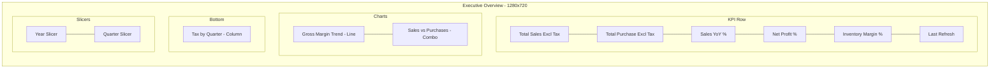
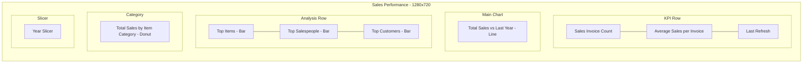
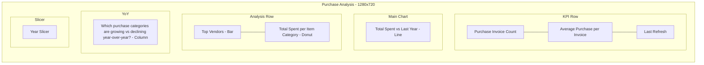
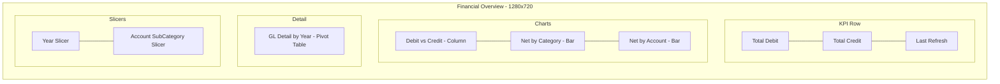
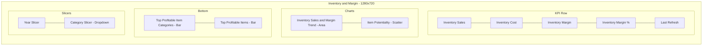

# CRONUS Report Design Specification

> **Document Type:** Report Design Specification (RDS)
> **Report:** CRONUS Data Modeling & Visualization
> **Source System:** Dynamics 365 Business Central — CRONUS UK Ltd.
> **Semantic Model:** Star schema (Import mode) with 8 dimensions, 4 facts, 4 measure groups, 1 utility table
> **Theme:** NewExecutive (custom) layered on CY26SU04 (base)
> **Canvas:** 1280 × 720, FitToPage
> **Currency:** £ (GBP)

---

## Purpose of This Document

A Report Design Specification (RDS) documents the **what and why** of every visual on every page of a Power BI report. It serves as:

- **Requirements artifact** — agreed-upon contract between business stakeholders and the developer before (or after) build
- **Technical reference** — maps each visual to its semantic model objects (measures, columns, relationships)
- **Change log baseline** — enables impact analysis when measures, relationships, or business questions change
- **Onboarding guide** — lets new team members understand the report without reverse-engineering it

This document follows industry best practices drawn from Microsoft's Power BI implementation planning guidance, the BRD (Business Requirements Document) framework, and the question-driven requirements approach (Route 3: "What questions are we trying to answer?").

---

## Document Structure

Each page is documented with:

| Section | Description |
|---|---|
| **Page Name** | Display name as it appears on the report tab |
| **Business Question** | The core question this page answers — the "why" |
| **Target Audience** | Primary and secondary user roles |
| **Page-Level Filters** | Slicers that affect all visuals on the page |
| **Visual Specification Table** | Per-visual detail: title, type, data bindings, conditional formatting, tooltips, and insight |
| **Cross-Filtering Notes** | How visuals interact with each other on the page |

---

## Semantic Model Objects Reference

### Measures

| Measure Group | Measure | Format | Description |
|---|---|---|---|
| MeasureSales | Total Sales Excl Tax | £#,0.00 | Revenue from sales invoices (SUMX+MIN pattern) |
| MeasureSales | Total Sales Incl Tax | £#,0.00 | Revenue including tax |
| MeasureSales | Sales Invoice Count | #,##0 | Distinct count of sales invoices |
| MeasureSales | Average Sales per Invoice | £#,0.00 | Revenue ÷ invoice count |
| MeasureSales | Sales YTD | £#,0.00 | Year-to-date cumulative sales |
| MeasureSales | Sales MTD | £#,0.00 | Month-to-date cumulative sales |
| MeasureSales | Sales PY | £#,0.00 | Same period last year sales |
| MeasureSales | Sales YoY % | 0.0% | Year-over-year sales growth |
| MeasureSales | Sales Tax Amount | £#,0.00 | VAT collected on sales |
| MeasureSales | Gross Profit | £#,0.00 | Sales − Purchases |
| MeasureSales | Gross Margin % | 0.00% | Gross Profit ÷ Sales |
| MeasurePurchases | Total Purchase Excl Tax | £#,0.00 | Spending on purchase invoices (SUMX+MIN pattern) |
| MeasurePurchases | Total Purchase Incl Tax | £#,0.00 | Spending including tax |
| MeasurePurchases | Purchase Invoice Count | 0 | Distinct count of purchase invoices |
| MeasurePurchases | Average Purchase per Invoice | £#,0.00 | Spending ÷ invoice count |
| MeasurePurchases | Purchase YTD | £#,0.00 | Year-to-date cumulative purchases |
| MeasurePurchases | Purchase MTD | £#,0.00 | Month-to-date cumulative purchases |
| MeasurePurchases | Purchase PY | £#,0.00 | Same period last year purchases |
| MeasurePurchases | Purchase YoY % | 0.0% | Year-over-year purchase growth |
| MeasurePurchases | Purchase Tax Amount | £#,0.00 | VAT paid on purchases |
| MeasureGL | GL Debit | £#,0.00 | Sum of all debit entries |
| MeasureGL | GL Credit | £#,0.00 | Sum of all credit entries |
| MeasureGL | GL Net | £#,0.00 | Debit − Credit (rounded to 2 decimals) |
| MeasureGL | Net Profit % | 0.00% | GL Net ÷ Total Sales |
| MeasureInventory | Inventory Cost Amount | £#,0.00 | COGS for Sale entries (negative in BC) |
| MeasureInventory | Inventory Sales Amount | £#,0.00 | Revenue from Sale entries |
| MeasureInventory | Inventory Margin | £#,0.00 | Sales Amount + Cost Amount (addition due to BC sign convention) |
| MeasureInventory | Inventory Margin % | 0.00% | Margin ÷ Sales Amount |
| CurrentDateTimeLocalTZ | Last Refresh | Text | Human-readable "Updated ..." timestamp |

### Key Dimension Columns Used in Visuals

| Table | Column | Used In |
|---|---|---|
| DimDate | Year | Slicers (all pages) |
| DimDate | Quarter | Slicer (Executive Overview), chart axes |
| DimDate | MonthYear | Chart axes (trend visuals) |
| DimCustomer | CustomerName | Bar charts (Sales, Inventory pages) |
| DimVendor | VendorName | Bar charts (Purchase page) |
| DimItem | ItemName | Bar charts, scatter chart |
| DimItem | ItemNumber | Scatter chart category |
| DimItem | ItemCategoryCode | Donut charts, bar charts, slicer |
| DimAccount | Category | Bar charts, pivot table rows |
| DimAccount | SubCategory | Pivot table rows, slicer |
| DimAccount | AccountName | Bar charts |
| DimAccount | AccountNumber | Pivot table rows |
| FactSalesInvoiceLine | Salesperson | Bar chart (Sales page) |

---

## Page 1: Executive Overview

**Business Question:** *How is the company performing overall — are we profitable and growing?*

**Target Audience:** C-suite, executive leadership, board members

**Page Layout:**

**Page-Level Filters:**

| Slicer | Column | Type | Notes |
|---|---|---|---|
| Year | DimDate[Year] | List | Affects all visuals on page |
| Quarter | DimDate[Quarter] | List | Affects all visuals on page; unique to this page |

**Visual Specifications:**

| # | Visual Title | Type | Data Role | Field Binding | Conditional Formatting | Tooltips | Insight |
|---|---|---|---|---|---|---|---|
| 1 | Total Sales Excl Tax | Card | Value | MeasureSales[Total Sales Excl Tax] | None | — | Current period revenue at a glance |
| 2 | Total Purchase Excl Tax | Card | Value | MeasurePurchases[Total Purchase Excl Tax] | None | — | Current period spending at a glance |
| 3 | Gross Margin Trend | Line Chart | Axis | DimDate[MonthYear] | None | — | Is gross margin improving or eroding over time? |
| | | | Values | MeasureSales[Gross Margin %] | | | |
| 4 | Sales vs Purchases | Line + Stacked Column Combo | Shared Axis | DimDate[MonthYear] | None | — | Are sales consistently outpacing purchases month over month? |
| | | | Column Values | MeasureSales[Total Sales Excl Tax] | | | |
| | | | Line Values | MeasurePurchases[Total Purchase Excl Tax] | | | |
| 5 | Tax by Quarter | Column Chart | Axis | DimDate[Quarter] | None | — | How much VAT are we collecting and paying per quarter? |
| | | | Legend | DimDate[Year] | | | |
| | | | Values | MeasureSales[Sales Tax Amount], MeasurePurchases[Purchase Tax Amount] | | | |
| 6 | Sales YoY % | Card | Value | MeasureSales[Sales YoY %] | None | — | Year-over-year sales growth at a glance |
| 7 | Net Profit % | Card | Value | MeasureGL[Net Profit %] | None | — | True bottom-line profitability after all expenses |
| 8 | Inventory Margin % | Card | Value | MeasureInventory[Inventory Margin %] | Color: red (< 0%), yellow (0–15%), green (> 30%) | — | Item-level profitability |
| 9 | Last Refresh | Card | Value | CurrentDateTimeLocalTZ[Last Refresh] | None | — | When was the data last refreshed? Displays "Updated Today at HH:mm", "Updated Yesterday at HH:mm", "Updated d MMM at HH:mm", or "Updated d MMM yyyy at HH:mm" |

**Cross-Filtering Notes:** Year and Quarter slicers filter all visuals simultaneously. Card visuals (KPIs) respond to slicer selections. Chart visuals cross-filter each other on click.

---

## Page 2: Sales Performance

**Business Question:** *How are sales trending over time, who are our best customers and salespeople, and which product categories sell the most?*

**Target Audience:** Sales managers, sales team leads

**Page Layout:**

**Page-Level Filters:**

| Slicer | Column | Type | Notes |
|---|---|---|---|
| Year | DimDate[Year] | List | Affects all visuals on page |

**Visual Specifications:**

| # | Visual Title | Type | Data Role | Field Binding | Conditional Formatting | Tooltips | Insight |
|---|---|---|---|---|---|---|---|
| 1 | Sales Invoice Count | Card | Value | MeasureSales[Sales Invoice Count] | None | — | How many invoices this period? |
| 2 | Average Sales per Invoice | Card | Value | MeasureSales[Average Sales per Invoice] | None | — | Is average deal size healthy? |
| 3 | Total Sales vs Last Year | Line Chart | Axis | DimDate[MonthYear] | Current year line: theme color; PY line: theme color at 20% opacity | — | Current vs. prior year — growing or declining? |
| | | | Values | MeasureSales[Total Sales Excl Tax] | | | |
| | | | Values (secondary) | MeasureSales[Sales PY] | | | |
| 4 | Top Items | Clustered Bar Chart | Axis | DimItem[ItemName] | None | — | Which products generate the most revenue? |
| | | | Values | MeasureSales[Total Sales Excl Tax] | | | |
| 5 | Top Salespeople | Clustered Bar Chart | Axis | FactSalesInvoiceLine[Salesperson] | None | — | Which salespeople drive the most revenue? |
| | | | Values | MeasureSales[Total Sales Excl Tax] | | | |
| 6 | Top Customers | Clustered Bar Chart | Axis | DimCustomer[CustomerName] | None | — | Who are the top revenue-generating customers? |
| | | | Values | MeasureSales[Total Sales Excl Tax] | | | |
| 7 | Total Sales by Item Category | Donut Chart | Legend | DimItem[ItemCategoryCode] | None | — | Which product categories contribute the most to revenue? |
| | | | Values | MeasureSales[Total Sales Excl Tax] | | | |
| 8 | Last Refresh | Card | Value | CurrentDateTimeLocalTZ[Last Refresh] | None | — | When was the data last refreshed? |
| 9 | Year Slicer | Slicer | Field | DimDate[Year] | — | — | Cross-page year filter |

**Cross-Filtering Notes:** Clicking a bar in "Top Items" cross-filters the donut and line chart. Clicking a customer in "Top Customers" cross-filters other charts. Year slicer affects all visuals.

---

## Page 3: Purchase Analysis

**Business Question:** *How are purchase costs trending, which vendors cost us the most, and are purchase costs rising faster than sales?*

**Target Audience:** Procurement managers, finance operations

**Page Layout:**

**Page-Level Filters:**

| Slicer | Column | Type | Notes |
|---|---|---|---|
| Year | DimDate[Year] | List | Affects all visuals on page |

**Visual Specifications:**

| # | Visual Title | Type | Data Role | Field Binding | Conditional Formatting | Tooltips | Insight |
|---|---|---|---|---|---|---|---|
| 1 | Purchase Invoice Count | Card | Value | MeasurePurchases[Purchase Invoice Count] | None | — | How many purchase invoices? |
| 2 | Average Purchase per Invoice | Card | Value | MeasurePurchases[Average Purchase per Invoice] | None | — | Average cost per purchase? |
| 3 | Total Spent vs Last Year | Line Chart | Axis | DimDate[MonthYear] | None | Average Purchase per Invoice, Purchase Invoice Count | Are monthly purchase costs trending up or down vs. last year? |
| | | | Values | MeasurePurchases[Total Purchase Excl Tax] | | | |
| | | | Values (secondary) | MeasurePurchases[Purchase PY] | | | |
| 4 | Top Vendors | Clustered Bar Chart | Axis | DimVendor[VendorName] | None | — | Which vendors account for the most spending? |
| | | | Values | MeasurePurchases[Total Purchase Excl Tax] | | | |
| 5 | Total Spent per Item Category | Donut Chart | Legend | DimItem[ItemCategoryCode] | None | — | Which categories cost the most? |
| | | | Values | MeasurePurchases[Total Purchase Excl Tax] | | | |
| 6 | Which purchase categories are growing vs declining year-over-year? | Clustered Column Chart | Axis | DimDate[MonthYear] | None | — | Are purchase costs rising vs. last year by category and month? |
| | | | Legend | DimItem[ItemCategoryCode] | | | |
| | | | Values | MeasurePurchases[Purchase YoY %] | | | |
| 7 | Last Refresh | Card | Value | CurrentDateTimeLocalTZ[Last Refresh] | None | — | When was the data last refreshed? |
| 8 | Year Slicer | Slicer | Field | DimDate[Year] | — | — | Cross-page year filter |

**Cross-Filtering Notes:** Clicking a vendor cross-filters the donut and YoY chart. YoY column chart uses multi-series by ItemCategoryCode legend.

---

## Page 4: Financial Overview

**Business Question:** *What is the company's true financial position — which accounts are profitable, which are losing money, and how do debits and credits compare over time?*

**Target Audience:** Finance teams, controllers, CFO

**Page Layout:**

**Page-Level Filters:**

| Slicer | Column | Type | Notes |
|---|---|---|---|
| Year | DimDate[Year] | List | Affects all visuals on page |
| Account SubCategory | DimAccount[SubCategory] | List (hidden title) | Filters to specific account sub-categories |

**Visual Specifications:**

| # | Visual Title | Type | Data Role | Field Binding | Conditional Formatting | Tooltips | Insight |
|---|---|---|---|---|---|---|---|
| 1 | Total Debit | Card | Value | MeasureGL[GL Debit] | None | — | Total money received/assets increased |
| 2 | Total Credit | Card | Value | MeasureGL[GL Credit] | None | — | Total money paid out/liabilities increased |
| 3 | Debit vs Credit | Column Chart | Axis | DimDate[MonthYear] | None | — | Are debits consistently higher than credits? |
| | | | Values | MeasureGL[GL Debit], MeasureGL[GL Credit] | | | |
| 4 | Net by Category | Clustered Bar Chart | Axis | DimAccount[Category] | None | — | Which account categories are net positive vs. negative? |
| | | | Values | MeasureGL[GL Net] | | | |
| 5 | Net by Account | Clustered Bar Chart | Axis | DimAccount[AccountName] | None | — | Which specific accounts drive profit or loss? |
| | | | Values | MeasureGL[GL Net] | | | |
| 6 | GL Detail by Year | Pivot Table | Rows | DimAccount[Category] → [SubCategory] → [AccountNumber] | None | — | Full drill-down financial statement, year over year |
| | | | Columns | DimDate[Year] | | | |
| | | | Values | MeasureGL[GL Debit], MeasureGL[GL Credit], MeasureGL[GL Net] | | | |
| 7 | Last Refresh | Card | Value | CurrentDateTimeLocalTZ[Last Refresh] | None | — | When was the data last refreshed? |
| 8 | Year Slicer | Slicer | Field | DimDate[Year] | — | — | Cross-page year filter |
| 9 | Account SubCategory Slicer | Slicer | Field | DimAccount[SubCategory] | — | — | Filter to specific sub-categories |

**Cross-Filtering Notes:** SubCategory slicer filters all visuals including the pivot table. Clicking a category in "Net by Category" cross-filters "Net by Account" and the pivot table.

---

## Page 5: Inventory & Margin

**Business Question:** *How profitable is our inventory — which items and categories have the best margins, and is item-level profitability improving over time?*

**Target Audience:** Inventory managers, product managers, category managers

**Page Layout:**

**Page-Level Filters:**

| Slicer | Column | Type | Notes |
|---|---|---|---|
| Year | DimDate[Year] | List | Affects all visuals on page |
| Category | DimItem[ItemCategoryCode] | Dropdown | Filters to specific product categories |

**Visual Specifications:**

| # | Visual Title | Type | Data Role | Field Binding | Conditional Formatting | Tooltips | Insight |
|---|---|---|---|---|---|---|---|
| 1 | Inventory Sales | Card | Value | MeasureInventory[Inventory Sales Amount] | None | — | Total revenue from item ledger Sale entries |
| 2 | Inventory Cost | Card | Value | MeasureInventory[Inventory Cost Amount] | None | — | Total COGS (negative value in BC) |
| 3 | Inventory Margin | Card | Value | MeasureInventory[Inventory Margin] | Color: green if positive, red if negative | — | Total margin on inventory items |
| 4 | Inventory Margin % | Card | Value | MeasureInventory[Inventory Margin %] | Color: red (< 0%), yellow (0–15%), green (> 30%) | — | Overall margin percentage |
| 5 | Inventory Sales & Margin Trend | Area Chart | Axis | DimDate[MonthYear] | None | — | Is margin growing proportionally with sales? |
| | | | Values | MeasureInventory[Inventory Sales Amount], MeasureInventory[Inventory Margin] | | | |
| 6 | Item Potentiality | Scatter Chart | Details | DimItem[ItemNumber] | None | — | Identify high-margin/low-volume vs. low-margin/high-volume items |
| | | | X Axis | MeasureInventory[Inventory Sales Amount] | | | |
| | | | Y Axis | MeasureInventory[Inventory Margin %] | | | |
| | | | Size | MeasureInventory[Inventory Margin] | | | |
| 7 | Top Profitable Item Categories | Clustered Bar Chart | Axis | DimItem[ItemCategoryCode] | None | — | Which categories have the highest margin %? |
| | | | Values | MeasureInventory[Inventory Margin %] | | | |
| 8 | Top Profitable Items | Clustered Bar Chart | Axis (drill-down) | DimItem[ItemName] → DimCustomer[CustomerName] | Conditional color by Inventory Margin value: red (< £0), yellow (£0–£15K), green (> £30K) | Data labels: shown | Which items generate the most absolute margin? Drill to customer level |
| | | | Values | MeasureInventory[Inventory Margin] | | | |
| 9 | Last Refresh | Card | Value | CurrentDateTimeLocalTZ[Last Refresh] | None | — | When was the data last refreshed? |
| 10 | Year Slicer | Slicer | Field | DimDate[Year] | — | — | Cross-page year filter |
| 11 | Category Slicer | Slicer (Dropdown) | Field | DimItem[ItemCategoryCode] | — | — | Filter to specific product categories |

**Cross-Filtering Notes:** Category dropdown slicer filters all visuals. "Top Profitable Items" supports drill-down from ItemName to CustomerName. Scatter chart points cross-filter bar charts on selection.

---

## Conditional Formatting Summary

| Visual | Measure | Element | Rule |
|---|---|---|---|
| Executive Overview — Inventory Margin % | Inventory Margin % | Card value color | Red < 0%, Yellow 0–15%, Green > 30% |
| Inventory & Margin — Inventory Margin | Inventory Margin | Card value color | Green if positive, Red if negative |
| Inventory & Margin — Inventory Margin % | Inventory Margin % | Card value color | Red < 0%, Yellow 0–15%, Green > 30% |
| Inventory & Margin — Top Profitable Items | Inventory Margin | Bar fill color | Red < £0, Yellow £0–£15K, Green > £30K |

---

## Data Refresh Indicator

Every page includes a **Last Refresh** card bound to `CurrentDateTimeLocalTZ[Last Refresh]`. This measure evaluates `DateTime.LocalNow()` at refresh time and displays a human-readable relative timestamp:

| Days Since Refresh | Display Format | Example |
|---|---|---|
| 0 (today) | "Updated Today at HH:mm" | "Updated Today at 14:30" |
| 1 (yesterday) | "Updated Yesterday at HH:mm" | "Updated Yesterday at 09:15" |
| 2–364 | "Updated d MMM at HH:mm" | "Updated 3 Mar at 11:00" |
| 365+ | "Updated d MMM yyyy at HH:mm" | "Updated 3 Mar 2024 at 11:00" |

---

## Design Decisions & Rationale

| Decision | Rationale |
|---|---|
| SUMX+MIN pattern for header amounts | Avoids double-counting when multiple line items share the same invoice header totals |
| Inventory Margin uses addition (+) not subtraction (−) | BC stores CostAmountActual as negative for Sale entries; adding negative cost to positive sales yields the margin |
| Year slicer on every page | Consistent cross-page filtering; Quarter slicer only on Executive Overview to avoid clutter |
| Last Refresh on every page | Data freshness transparency — critical for executive trust in the numbers |
| Salesperson column from FactSalesInvoiceLine (not DimCustomer) | Salesperson is a header-level field on the invoice, not a customer attribute |
| Category slicer as Dropdown (not List) | Saves canvas space on the Inventory page where many visuals compete for room |
| Conditional formatting on margin cards | Immediate visual signal: green = healthy, yellow = warning, red = problem — no need to read the number |

---

## Appendix: Visual Count Summary

| Page | Cards | Charts | Slicers | Textbox | Total |
|---|---|---|---|---|---|
| Executive Overview | 6 | 3 | 2 | 1 | 12 |
| Sales Performance | 3 | 4 | 1 | 1 | 9 |
| Purchase Analysis | 3 | 4 | 1 | 1 | 9 |
| Financial Overview | 3 | 3 | 2 | 1 | 9 |
| Inventory & Margin | 5 | 4 | 2 | 1 | 12 |
| **Total** | **20** | **18** | **8** | **5** | **51** |
